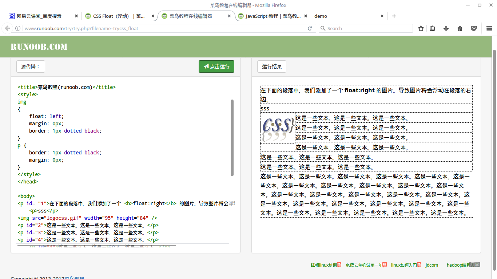

# HTML——元素定位

## position 属性指定了元素的定位类型
position 属性的四个值：
- static： HTML元素的默认值，即没有定位，元素出现在正常的流中。静态定位的元素不会受到 top, bottom, left, right影响。
- relative： 相对定位是相对正常原始位置。
- fixed： 元素的位置相对于浏览器窗口是固定位置。即使窗口是滚动的它也不会移动。
- absolute： 绝对定位的元素的位置相对于最近的已定位父元素，如果元素没有已定位的父元素，那么它的位置相对于<html>
- z-index: 元素重叠前后顺序，数字越大，越在前边。

## Overflow 文本溢出文本框
overflow有三个属性值：
- scroll
- hidden
- visible

text-overflow 使用何种符号标示还有未显示的文本
- ellipsis
- clip
- string： 自己设定显示符号

## float 浮动
### 厘清概念
float属性只对本元素以及之后的元素请作用，不对之前的元素起作用。
float只对块级元素起作用
原本块级元素要独占height(即：content+padding+margin)高度的行，属性设置为`float： left；`之后,元素往左侧`<body>`边框位置靠拢（当然 设置的margin padding还是起作用），自然右侧就会出现空白空间。
后续元素会按照它们原本的显示方式 浮动到 右边空白处,**紧靠** 左侧元素，直到`width`或`height`占满。
所谓紧靠是指 左侧的元素`margin`属性依旧起作用，随后的元素`content`贴紧在左侧元素`margin`处。也就是说就随其后的元素`padding`和`margin`属性不再其作用了。
如果后续元素不想受到前边元素的`float`属性影响，可以使用`clear：[both|left|right]`清除。
 This is a instruction image.
